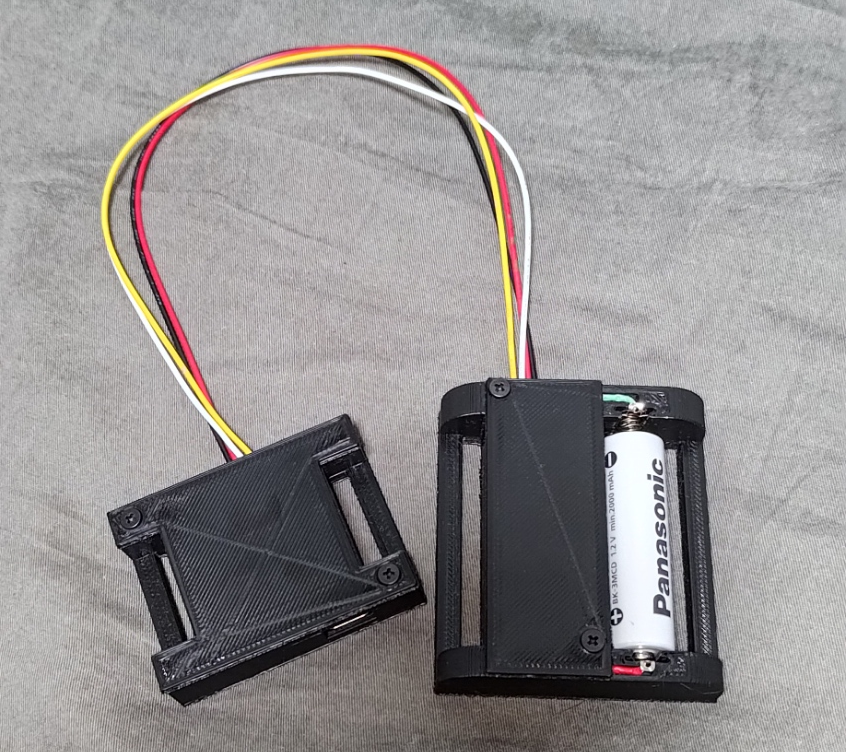

# Yozolab-JellyTracker

### ✨️現在作成中です！✨️

私の作った[SlimeVR](https://github.com/SlimeVR)トラッカーに関するリポジトリです。

## FW書き込みについて(書き途中です)
JellyTrackerを私から購入した場合、WebページからFWの更新ができます \
https://jt-webflash.yozolab.net/

## 動作確認済みデータ
- [x] JellyTracker_V0.2.0
- [x] JellyTracker_V0.5.0
- [x] LSM_Module_V0.1.0
- [x] Ni-MH_3.3V-Module_V0.1.0

## KiCADデータについて
(今のところ)すべてKiCAD 7.0で作成されています\
私の導入しているプラグイン
- Espressif Library
- KiCAD JLCPCB tools

## JT_V0.5.0
